桥接模式：虚拟系统Linux可以和外部系统进行通信，但是会造成IP冲突，相当于是在使用了外部的一个主机IP

NAT模式：虚拟系统可以不使用同一个网段的IP，可以在外部生成一个虚拟的IP，并且虚拟系统可以和外部系统进行通信，且不会发生IP冲突，

主机模式：独立系统，不与外界发生联系

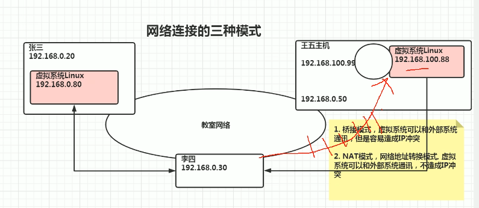

虚拟机克隆：

直接进行复制粘贴，再打开vmx文件就可， 直接使用vmware进行克隆

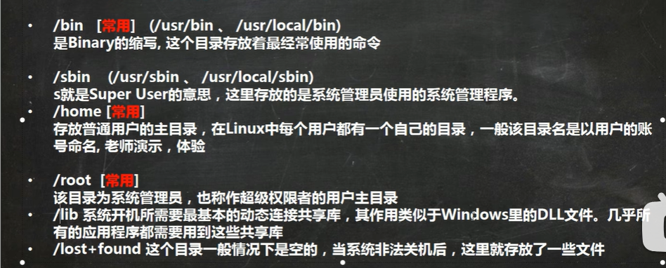

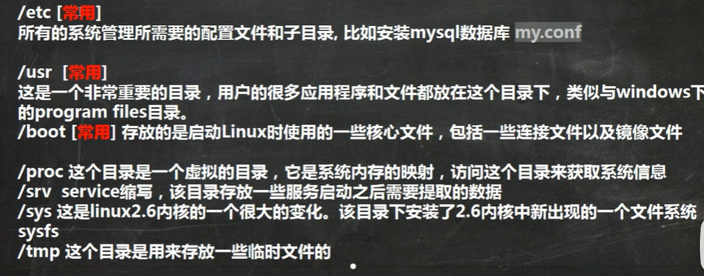

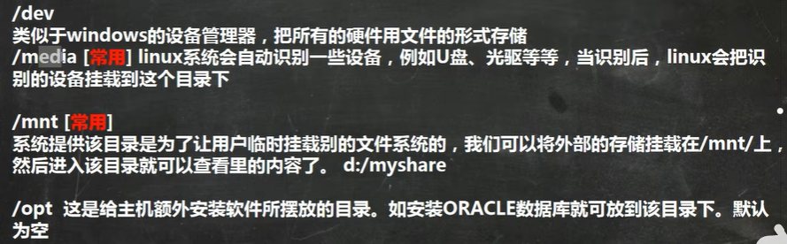

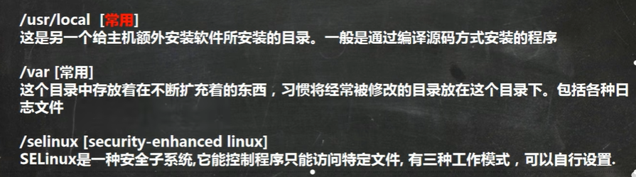

VI/Vim快捷键

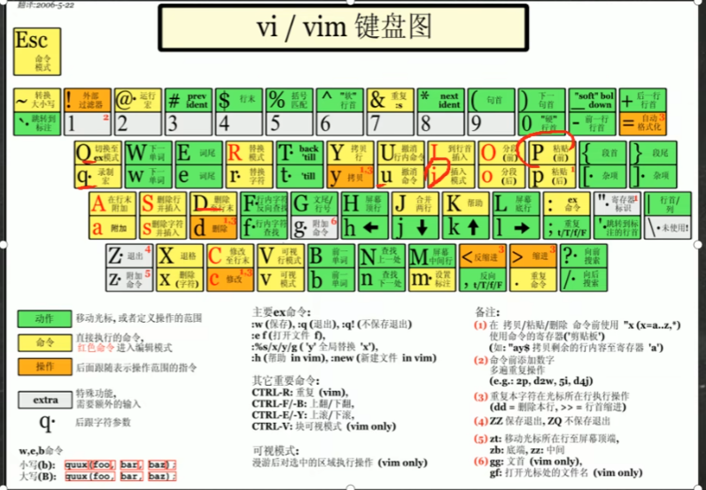

开关机：

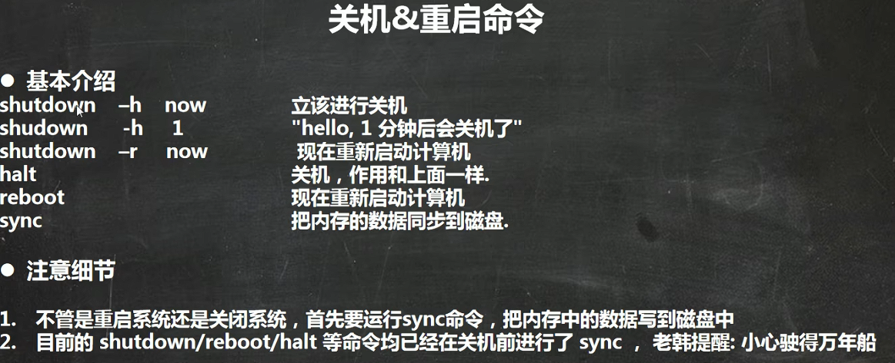

远程登录注销，但是再vm内部用exit，使用logout无效

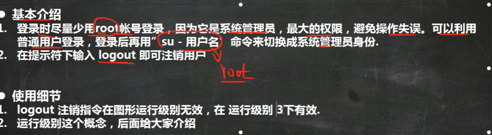

添加用户

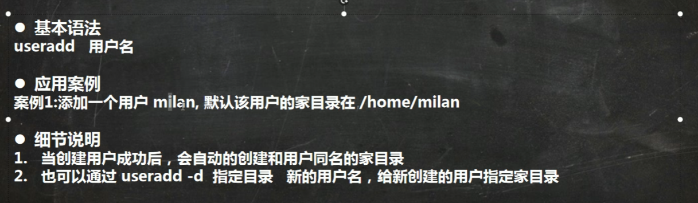

设置密码

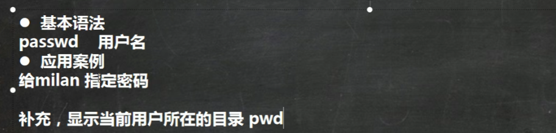

删除用户

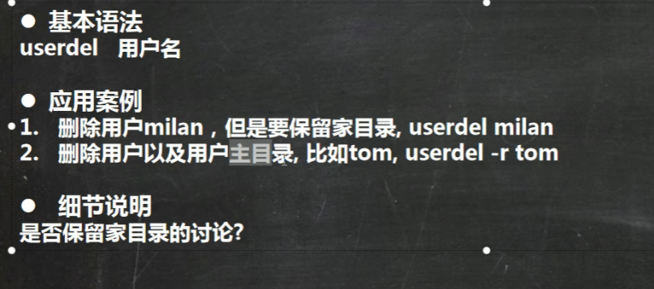

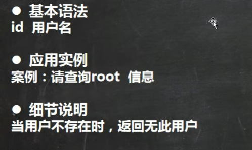

切换用户，查看当前用户：who am i

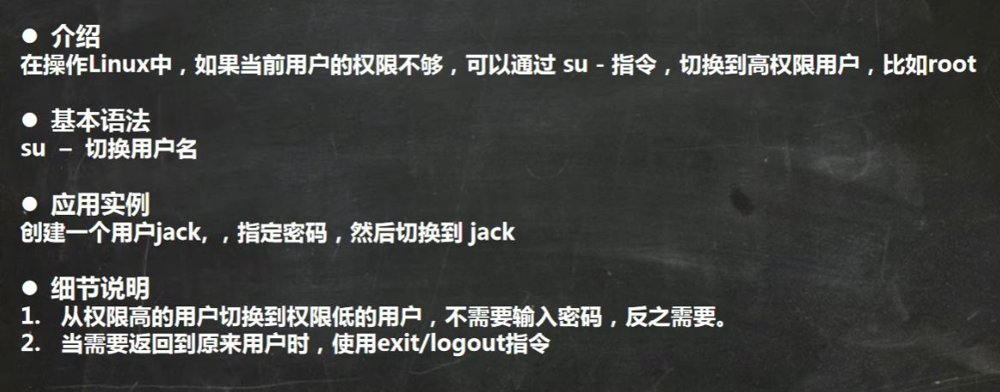

添加用户组

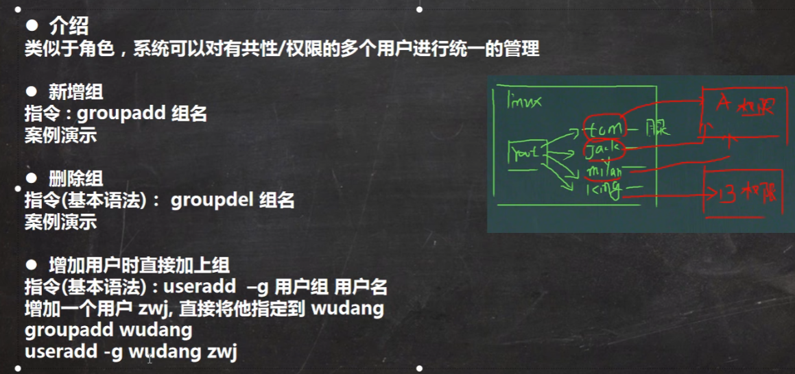

切换用户组：

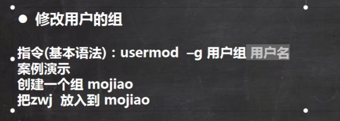

用户组文件

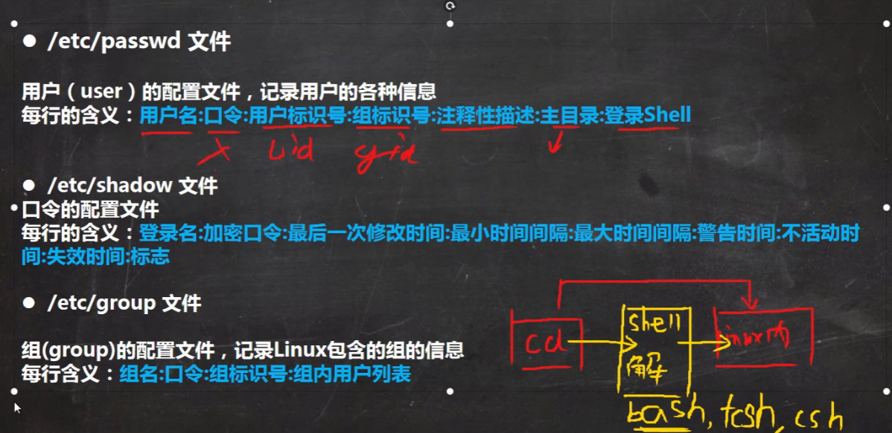

运行级别

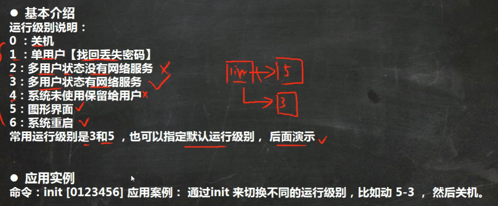

指定运行级别

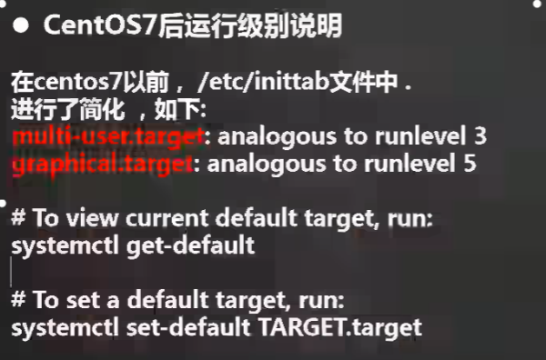

帮助指令

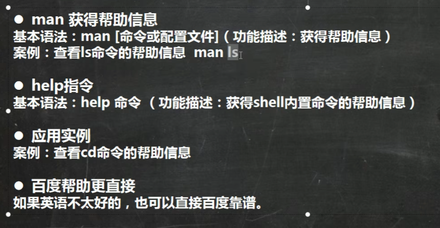

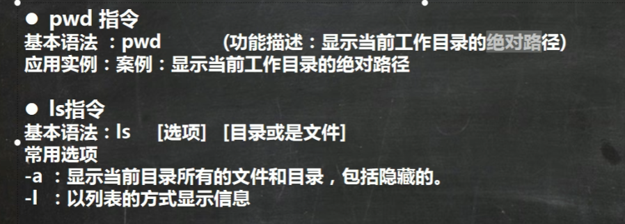

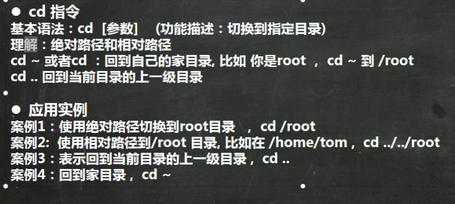

创建目录

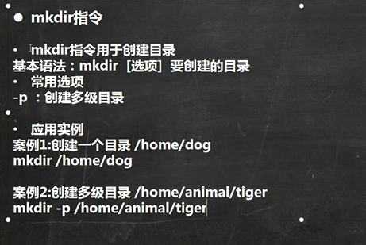

删除目录

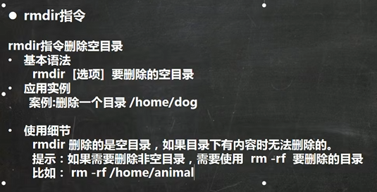

创建一个新的空文件

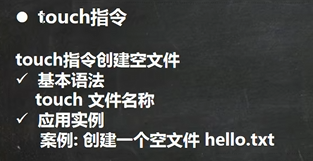

拷贝文件和目录

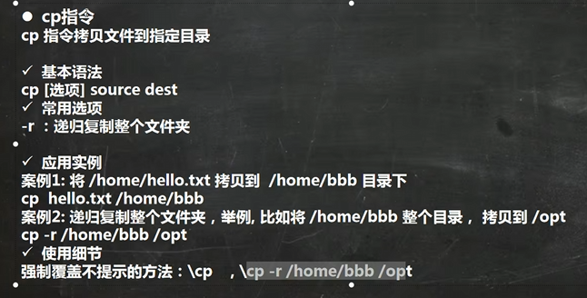

删除整个文件或者目录

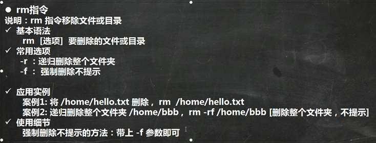

移动或者修改名称

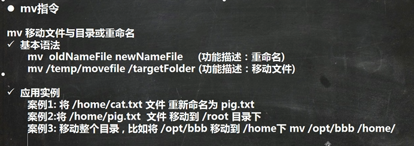

查看内容

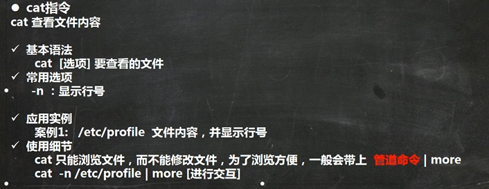

More

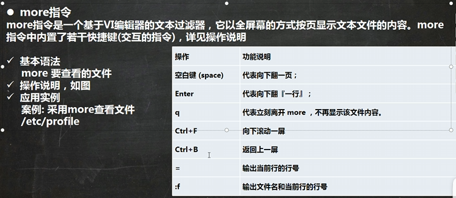

Less

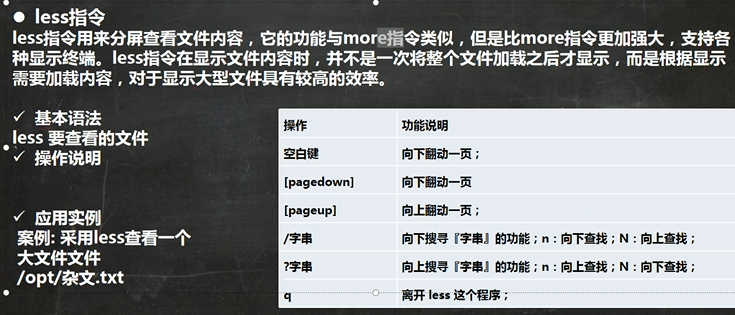

输出指令

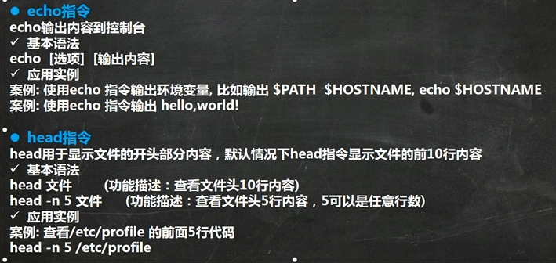

Tail指令

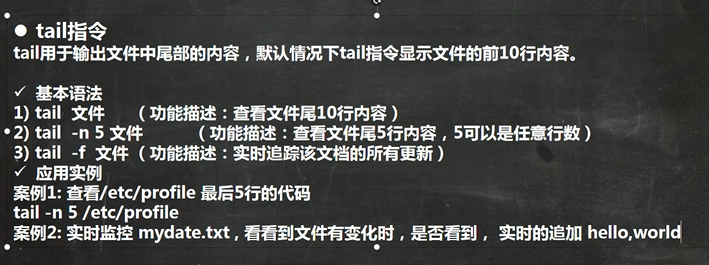

追加指令\> \>\>

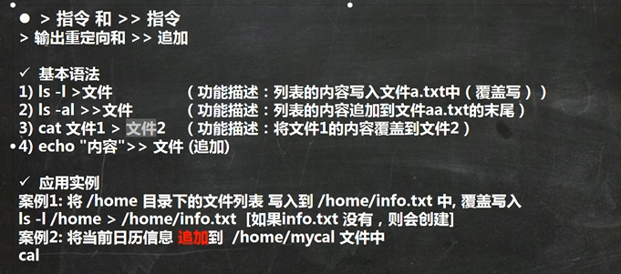

软连接

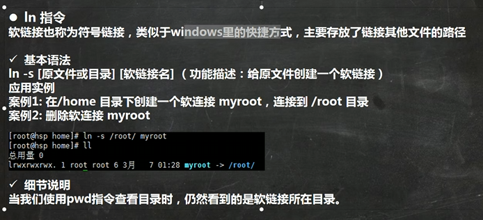

历史命令

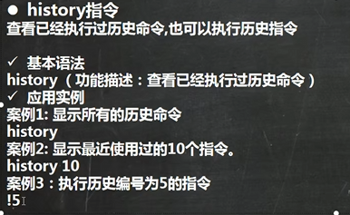

时间日期类指令
