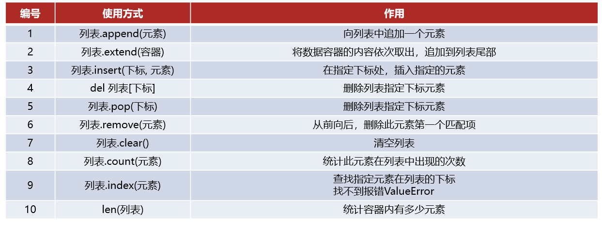
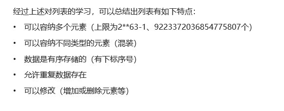
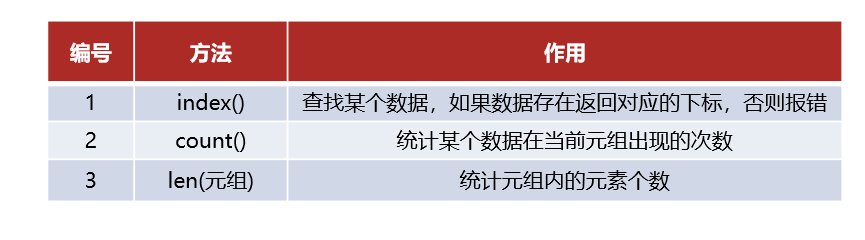
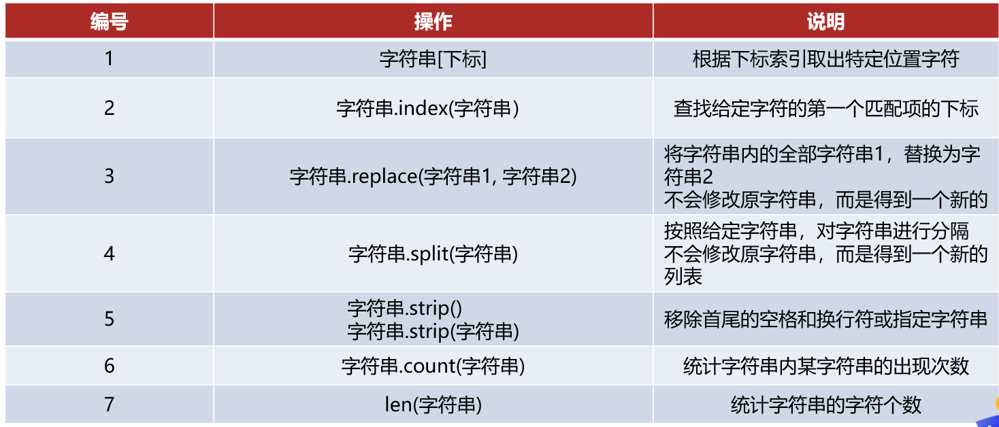
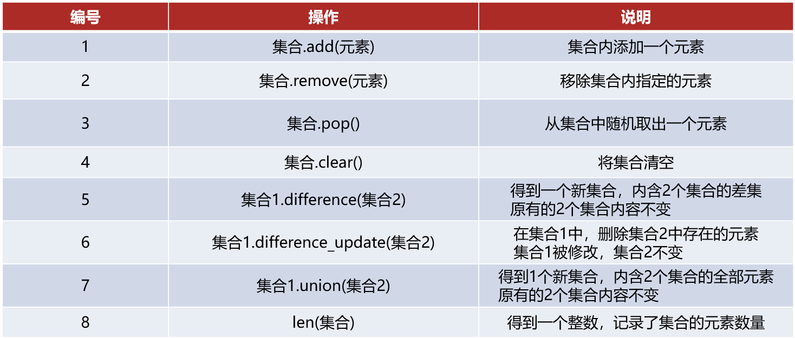
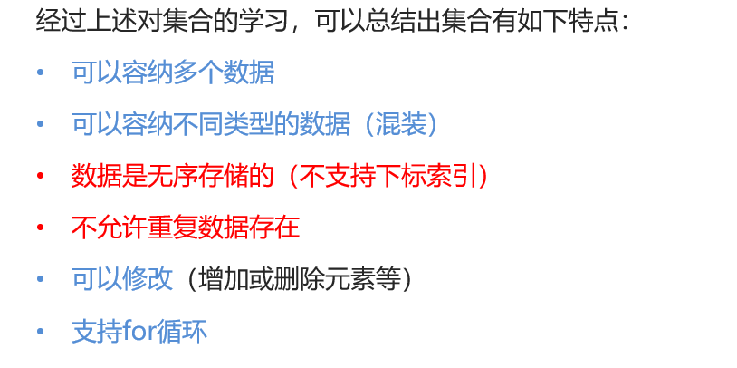
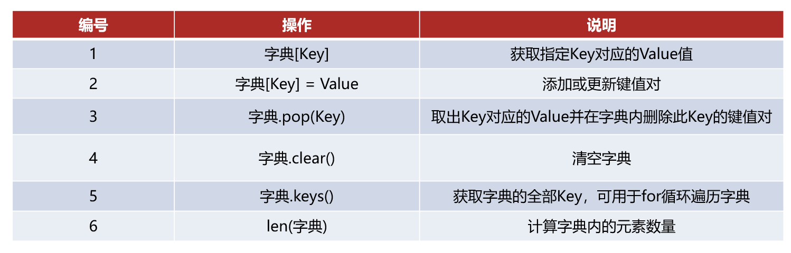
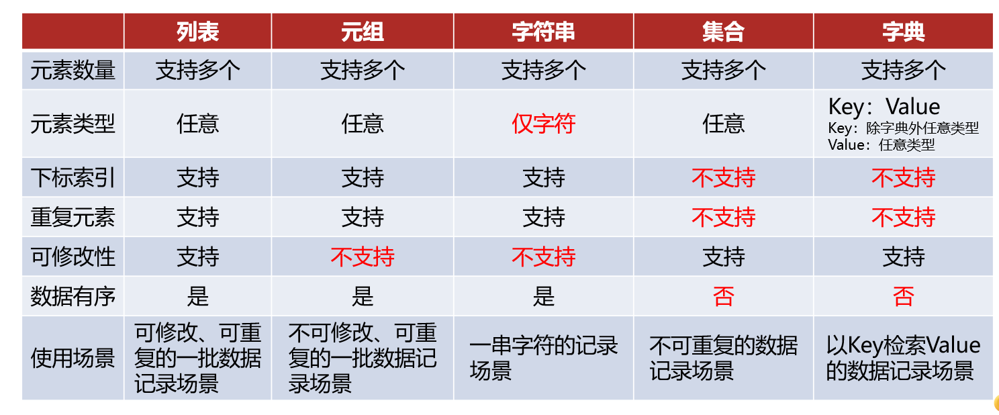
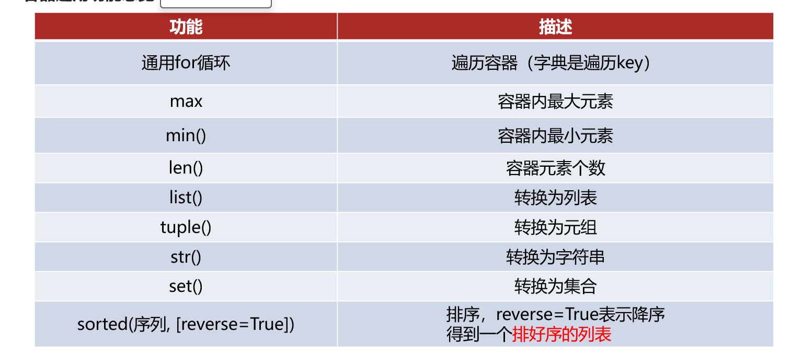

二

字面量：被写下来的固定的值：数字，字符串，列表，元组，集合，字典

注释：单行注释#，多行注释一对三个引号

变量：在程序运行时，能够储存计算结果或能表示值的抽象概念

type(被查看类型的数据)
用来查看数据类型，也可以用来查看变量存储的数据类型

字符串可以用双引号，单引号，三引号表示，三引号可以表示多行是字符串

类型转换：int(x)，float(x)，str(x)都是带有结果的，可以用变量进行接收，也可以直接进行输出，任何类型都可以转换为字符串，反之不一定

标识符：在编程的时候所使用的一系列名字，用于给变量、类、方法命名，数字不能作为开头，不能用关键字

字符串引号嵌套：单引号内含双引号，双引号内含单引号，或\将引号解除引用

字符串拼接：+号只能拼接字符串变量或字符串字面量，但无法拼接非字符串

字符串格式化：使用占位符%，%s %
变量，多个变量占位变量需要用括号括起来，并且按顺序填入，

精度控制：m用于控制精度，可省略，.n用于控制小数点精度，会进行舍入

快速格式化：f“内容{变量}”

input(提示信息)进行数据输入，无论输入的是什么内容，获取的数据都是字符串类型

3判断语句

if 事 ：

if else，else后面不需要判断条件，同一个判断if和else需要对齐，

if elif
else，多次进行判断，同一个都需要对齐，判断是互斥有序的，满足上一个下一个就不满足了

嵌套使用if，只需要进行缩进

4循环语句

while语句

while 条件：

语句

while语句可以自行控制循环条件，for语句轮询进行，必须要逐个处理，for不能无限进行循环

for语句：

for 临时变量 in 待处理数据集：

循环

range(num)获取一个从0开始，到num结束的数字序列

range(num1,num2,step)

contiune：中断本次循环，进入下一次循环

break：直接结束所在循环

5函数

def 函数名（传入参数）：

函数体

return 返回值

无返回值就是None

None用函数无返回值上，用在if判断中相当于False，用在函数中主动返回None，配合if判断做相关处理，用于定义暂时不需要具体值的变量

使用global可以将函数内部声明变量转换为全局变量

6数据容器

1列表

变量名称=\[\]，内部每一个元素之间用逗号隔开，支持嵌套，空列表用\[\]或者列变量名称=list()
列表支持下标索引，反向索引从-1开始，索引用\[\]

2元组

元组不可以被修改，空元组：变量名称=()，变量名称=tuple()，当元组内只有一个元素时，这个数据后面要加逗号

元组中内容不能进行修改，但是可以修改元组中嵌套的列表中的内容

3字符串

字符串也无法进行修改，修改只会得到一个新的字符串，旧的字符串无法修改，

4集合{}

不支持重复元素，且内容无序，空集合{}，或者变量名称=set{}

字典：

数据容器

数据容器通用排序：sorted（容器，\[reverse = True\]）排序以后都会得到list

7函数进阶

多返回值，直接返回，用不同的变量按顺序接收

位置传参时需要按顺序传参，

关键字传参不需要按照顺序但是位置参数必须放在关键字参数前面，

缺省参数用于在定义参数的时候提供默认值，调用函数的时候可以不传参数，若调用参数的时候缺省参数传值则修改默认值
